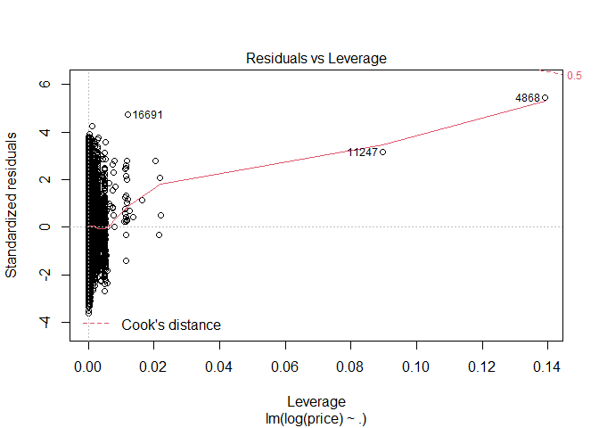

Regression Analysis of NYC Airbnb Data
================
Shweta Gupta

 

  <B>For this project I have decided to use The NYC Airbnb dataset
from Kaggle.com. I have chosen New York City as it is one of the largest
and most popular tourist destinations in the world with a large amount
of Airbnb listings.<B>  

  <B> EDA </B>  

The Datset is about Airbnb listings for different hosts in the boroughs
of NYC. It Consist of 48895 observatuon with 16 variable. It offers
detailed information regarding the price, number of reviews per month
and its availability throughout the year.

    ##        id               name              host_id           host_name        
    ##  Min.   :    2539   Length:48895       Min.   :     2438   Length:48895      
    ##  1st Qu.: 9471945   Class :character   1st Qu.:  7822033   Class :character  
    ##  Median :19677284   Mode  :character   Median : 30793816   Mode  :character  
    ##  Mean   :19017143                      Mean   : 67620011                     
    ##  3rd Qu.:29152178                      3rd Qu.:107434423                     
    ##  Max.   :36487245                      Max.   :274321313                     
    ##                                                                              
    ##  neighbourhood_group neighbourhood         latitude       longitude     
    ##  Length:48895        Length:48895       Min.   :40.50   Min.   :-74.24  
    ##  Class :character    Class :character   1st Qu.:40.69   1st Qu.:-73.98  
    ##  Mode  :character    Mode  :character   Median :40.72   Median :-73.96  
    ##                                         Mean   :40.73   Mean   :-73.95  
    ##                                         3rd Qu.:40.76   3rd Qu.:-73.94  
    ##                                         Max.   :40.91   Max.   :-73.71  
    ##                                                                         
    ##   room_type             price         minimum_nights    number_of_reviews
    ##  Length:48895       Min.   :    0.0   Min.   :   1.00   Min.   :  0.00   
    ##  Class :character   1st Qu.:   69.0   1st Qu.:   1.00   1st Qu.:  1.00   
    ##  Mode  :character   Median :  106.0   Median :   3.00   Median :  5.00   
    ##                     Mean   :  152.7   Mean   :   7.03   Mean   : 23.27   
    ##                     3rd Qu.:  175.0   3rd Qu.:   5.00   3rd Qu.: 24.00   
    ##                     Max.   :10000.0   Max.   :1250.00   Max.   :629.00   
    ##                                                                          
    ##  last_review        reviews_per_month calculated_host_listings_count
    ##  Length:48895       Min.   : 0.010    Min.   :  1.000               
    ##  Class :character   1st Qu.: 0.190    1st Qu.:  1.000               
    ##  Mode  :character   Median : 0.720    Median :  1.000               
    ##                     Mean   : 1.373    Mean   :  7.144               
    ##                     3rd Qu.: 2.020    3rd Qu.:  2.000               
    ##                     Max.   :58.500    Max.   :327.000               
    ##                     NA's   :10052                                   
    ##  availability_365
    ##  Min.   :  0.0   
    ##  1st Qu.:  0.0   
    ##  Median : 45.0   
    ##  Mean   :112.8   
    ##  3rd Qu.:227.0   
    ##  Max.   :365.0   
    ## 

    ## 'data.frame':    48895 obs. of  16 variables:
    ##  $ id                            : int  2539 2595 3647 3831 5022 5099 5121 5178 5203 5238 ...
    ##  $ name                          : chr  "Clean & quiet apt home by the park" "Skylit Midtown Castle" "THE VILLAGE OF HARLEM....NEW YORK !" "Cozy Entire Floor of Brownstone" ...
    ##  $ host_id                       : int  2787 2845 4632 4869 7192 7322 7356 8967 7490 7549 ...
    ##  $ host_name                     : chr  "John" "Jennifer" "Elisabeth" "LisaRoxanne" ...
    ##  $ neighbourhood_group           : chr  "Brooklyn" "Manhattan" "Manhattan" "Brooklyn" ...
    ##  $ neighbourhood                 : chr  "Kensington" "Midtown" "Harlem" "Clinton Hill" ...
    ##  $ latitude                      : num  40.6 40.8 40.8 40.7 40.8 ...
    ##  $ longitude                     : num  -74 -74 -73.9 -74 -73.9 ...
    ##  $ room_type                     : chr  "Private room" "Entire home/apt" "Private room" "Entire home/apt" ...
    ##  $ price                         : int  149 225 150 89 80 200 60 79 79 150 ...
    ##  $ minimum_nights                : int  1 1 3 1 10 3 45 2 2 1 ...
    ##  $ number_of_reviews             : int  9 45 0 270 9 74 49 430 118 160 ...
    ##  $ last_review                   : chr  "2018-10-19" "2019-05-21" "" "2019-07-05" ...
    ##  $ reviews_per_month             : num  0.21 0.38 NA 4.64 0.1 0.59 0.4 3.47 0.99 1.33 ...
    ##  $ calculated_host_listings_count: int  6 2 1 1 1 1 1 1 1 4 ...
    ##  $ availability_365              : int  365 355 365 194 0 129 0 220 0 188 ...

 

Lets visualize the missing values in the data

    ## Loading required package: colorspace

    ## Loading required package: grid

    ## VIM is ready to use.

    ## Suggestions and bug-reports can be submitted at: https://github.com/statistikat/VIM/issues

    ## 
    ## Attaching package: 'VIM'

    ## The following object is masked from 'package:datasets':
    ## 
    ##     sleep

<!-- -->

    ## 
    ##  Variables sorted by number of missings: 
    ##                        Variable     Count
    ##                     last_review 0.2055834
    ##               reviews_per_month 0.2055834
    ##                              id 0.0000000
    ##                            name 0.0000000
    ##                         host_id 0.0000000
    ##                       host_name 0.0000000
    ##             neighbourhood_group 0.0000000
    ##                   neighbourhood 0.0000000
    ##                        latitude 0.0000000
    ##                       longitude 0.0000000
    ##                       room_type 0.0000000
    ##                           price 0.0000000
    ##                  minimum_nights 0.0000000
    ##               number_of_reviews 0.0000000
    ##  calculated_host_listings_count 0.0000000
    ##                availability_365 0.0000000

 

As we can see above, the ‘last\_review’ attribute contains only the
dates for which the airbnb property was last reviewed or the date when
the last review was generated. And if there was no review generated,
then there is no date and so we have a missing value in the column.

  Neighbourhood group and Room Type
<!-- -->

  We can see here, that most of the properties fall in the Brooklyn
or Manhattan neighbourhood group, while there very few properties in
Bronx and Staten Island.Manhattan and Brooklyn being the most popular
destination among the toursits. Also, most of the properties are
offering either a Private room or the Entire home/apt, there are very
few properties which are offering a Shared room. The reason for this can
be that most of the tourists or visitors want privacy and prefer either
a private room or to have the entire home/apt for themselves for their
convenience.

  Price Distribution

    ## `stat_bin()` using `bins = 30`. Pick better value with `binwidth`.

<!-- -->

    ##    Min. 1st Qu.  Median    Mean 3rd Qu.    Max. 
    ##     0.0    69.0   106.0   152.7   175.0 10000.0

  We can observe that prices of listing start from less than 100 and
maximum price reaches around 10000. The distribution curve shows that
most of listings prices ranges below 500.Also, the price is highly
skewed.

  Neighbourhood group and Price
<!-- -->

 

We can see here that the neighbourhood groups Manhattan, Brooklyn and
Staten Island have high price. While Bronx has the lowest price. This
can be because Manhattan, Brooklyn and Staten Islands are the most
expensive neighbourhoods in the New York City.  

  Correlation Matrix   Analyze the relationship between variables
<!-- -->
  The only strong correlation here is Reviews per Month and number of
reviews, which is expected as they are derivative of eachother.

   

<B> Feature Engineering

</B>

    ##      price         neighbourhood_group    host_id           room_type        
    ##  Min.   :   10.0   Length:48884        Min.   :     2438   Length:48884      
    ##  1st Qu.:   69.0   Class :character    1st Qu.:  7817310   Class :character  
    ##  Median :  106.0   Mode  :character    Median : 30792574   Mode  :character  
    ##  Mean   :  152.8                       Mean   : 67622035                     
    ##  3rd Qu.:  175.0                       3rd Qu.:107434423                     
    ##  Max.   :10000.0                       Max.   :274321313                     
    ##  minimum_nights    number_of_reviews    latitude       longitude     
    ##  Min.   :   1.00   Min.   :  0.00    Min.   :40.50   Min.   :-74.24  
    ##  1st Qu.:   1.00   1st Qu.:  1.00    1st Qu.:40.69   1st Qu.:-73.98  
    ##  Median :   3.00   Median :  5.00    Median :40.72   Median :-73.96  
    ##  Mean   :   7.03   Mean   : 23.27    Mean   :40.73   Mean   :-73.95  
    ##  3rd Qu.:   5.00   3rd Qu.: 24.00    3rd Qu.:40.76   3rd Qu.:-73.94  
    ##  Max.   :1250.00   Max.   :629.00    Max.   :40.91   Max.   :-73.71  
    ##  availability_365 calculated_host_listings_count
    ##  Min.   :  0.0    Min.   :  1.000               
    ##  1st Qu.:  0.0    1st Qu.:  1.000               
    ##  Median : 45.0    Median :  1.000               
    ##  Mean   :112.8    Mean   :  7.145               
    ##  3rd Qu.:227.0    3rd Qu.:  2.000               
    ##  Max.   :365.0    Max.   :327.000

<B> Linear regression to predict price </B>

    ## 
    ## Call:
    ## lm(formula = price ~ ., data = traindata)
    ## 
    ## Residuals:
    ##    Min     1Q Median     3Q    Max 
    ## -251.6  -63.7  -24.0   17.0 9853.7 
    ## 
    ## Coefficients:
    ##                                    Estimate Std. Error t value Pr(>|t|)    
    ## (Intercept)                      -2.859e+04  3.713e+03  -7.699 1.41e-14 ***
    ## neighbourhood_groupBrooklyn      -3.231e+01  1.009e+01  -3.203 0.001361 ** 
    ## neighbourhood_groupManhattan      3.260e+01  9.114e+00   3.577 0.000348 ***
    ## neighbourhood_groupQueens        -4.921e+00  9.684e+00  -0.508 0.611386    
    ## neighbourhood_groupStaten Island -1.484e+02  1.914e+01  -7.753 9.21e-15 ***
    ## host_id                           7.124e-08  1.622e-08   4.391 1.13e-05 ***
    ## room_typePrivate room            -1.070e+02  2.496e+00 -42.871  < 2e-16 ***
    ## room_typeShared room             -1.465e+02  8.019e+00 -18.271  < 2e-16 ***
    ## minimum_nights                   -3.263e-02  6.203e-02  -0.526 0.598886    
    ## number_of_reviews                -2.887e-01  2.776e-02 -10.400  < 2e-16 ***
    ## latitude                         -2.248e+02  3.617e+01  -6.215 5.17e-10 ***
    ## longitude                        -5.129e+02  4.166e+01 -12.313  < 2e-16 ***
    ## availability_365                  1.913e-01  9.901e-03  19.320  < 2e-16 ***
    ## calculated_host_listings_count   -2.198e-01  3.908e-02  -5.625 1.87e-08 ***
    ## ---
    ## Signif. codes:  0 '***' 0.001 '**' 0.01 '*' 0.05 '.' 0.1 ' ' 1
    ## 
    ## Residual standard error: 227.7 on 36649 degrees of freedom
    ## Multiple R-squared:  0.1016, Adjusted R-squared:  0.1013 
    ## F-statistic: 318.7 on 13 and 36649 DF,  p-value: < 2.2e-16

<!-- --><!-- --><!-- --><!-- -->

    ## [1] 52482.5

    ## [1] 229.0906

  The model accuracy is very poor which could be attributed to the
skewed distribution of the target variable price and therefore will
perform log transofrmation on price. Also,would filter out the outliers
by considering data which lies in the quantile range of 0.1 to 0.9.

<B> Linear model with logarithmic transformation
</B>

    ## 
    ## Call:
    ## lm(formula = log(price) ~ ., data = newtraindata)
    ## 
    ## Residuals:
    ##      Min       1Q   Median       3Q      Max 
    ## -1.19057 -0.23134 -0.01591  0.21303  1.66142 
    ## 
    ## Coefficients:
    ##                                    Estimate Std. Error  t value Pr(>|t|)    
    ## (Intercept)                      -1.211e+02  6.007e+00  -20.161  < 2e-16 ***
    ## neighbourhood_groupBrooklyn      -3.389e-02  1.720e-02   -1.971  0.04877 *  
    ## neighbourhood_groupManhattan      1.594e-01  1.574e-02   10.124  < 2e-16 ***
    ## neighbourhood_groupQueens         5.444e-02  1.663e-02    3.273  0.00106 ** 
    ## neighbourhood_groupStaten Island -5.415e-01  3.186e-02  -16.994  < 2e-16 ***
    ## host_id                           5.069e-12  2.679e-11    0.189  0.84992    
    ## room_typePrivate room            -5.373e-01  3.974e-03 -135.199  < 2e-16 ***
    ## room_typeShared room             -6.075e-01  1.696e-02  -35.827  < 2e-16 ***
    ## minimum_nights                   -1.365e-03  9.915e-05  -13.766  < 2e-16 ***
    ## number_of_reviews                -2.942e-04  4.341e-05   -6.778 1.25e-11 ***
    ## latitude                         -5.048e-01  5.812e-02   -8.686  < 2e-16 ***
    ## longitude                        -1.981e+00  6.750e-02  -29.352  < 2e-16 ***
    ## availability_365                  3.403e-04  1.631e-05   20.868  < 2e-16 ***
    ## calculated_host_listings_count    3.961e-04  6.804e-05    5.822 5.88e-09 ***
    ## ---
    ## Signif. codes:  0 '***' 0.001 '**' 0.01 '*' 0.05 '.' 0.1 ' ' 1
    ## 
    ## Residual standard error: 0.3279 on 29203 degrees of freedom
    ## Multiple R-squared:  0.4815, Adjusted R-squared:  0.4813 
    ## F-statistic:  2086 on 13 and 29203 DF,  p-value: < 2.2e-16

<!-- --><!-- --><!-- --><!-- --><!-- --><!-- -->

    ## [1] 0.4269718

    ## [1] 41.92749

  Plotting the predicted and observed values
<!-- -->
  After imputing the missing values, removing outliers and
transforming (lograthmic transformation) the output variable, Linear
model accuracy improved.  

<B> Ensemble methods </B>   Tree based learning
algorithms are considered to be one of the best and mostly used
supervised learning methods. It empower predictive models with high
accuracy, stability and ease of interpretation. Unlike linear models,
they map non-linear relationships quite well and are adaptable at
solving any kind of problem at hand (classification or regression).  
  Encoding Categorical Variables

  Decision Tree

    ## Warning in nominalTrainWorkflow(x = x, y = y, wts = weights, info = trainInfo, :
    ## There were missing values in resampled performance measures.

    ## Loading required package: bitops

    ## Rattle: A free graphical interface for data science with R.
    ## Version 5.4.0 Copyright (c) 2006-2020 Togaware Pty Ltd.
    ## Type 'rattle()' to shake, rattle, and roll your data.

    ## 
    ## Attaching package: 'rattle'

    ## The following object is masked from 'package:VIM':
    ## 
    ##     wine

    ## The following object is masked from 'package:xgboost':
    ## 
    ##     xgboost

<!-- -->

    ## CART 
    ## 
    ## 29217 samples
    ##    15 predictor
    ## 
    ## No pre-processing
    ## Resampling: Bootstrapped (25 reps) 
    ## Summary of sample sizes: 29217, 29217, 29217, 29217, 29217, 29217, ... 
    ## Resampling results across tuning parameters:
    ## 
    ##   cp          RMSE      Rsquared   MAE     
    ##   0.02094603  43.15241  0.3952788  33.52195
    ##   0.04402718  44.29233  0.3628917  34.59656
    ##   0.33981562  48.91037  0.3366560  39.30988
    ## 
    ## RMSE was used to select the optimal model using the smallest value.
    ## The final value used for the model was cp = 0.02094603.

    ## [1] "Training error: 43.5999012112265"

    ## [1] "Testing Error: 43.0039111337243"

 

As we can see from the above the tree, the model has used two predictors
room\_Type and longitude out of the 9 predictors which gives the maximum
information gain.

 

Random Forest

    ##  Connection successful!
    ## 
    ## R is connected to the H2O cluster: 
    ##     H2O cluster uptime:         3 hours 32 minutes 
    ##     H2O cluster timezone:       America/New_York 
    ##     H2O data parsing timezone:  UTC 
    ##     H2O cluster version:        3.32.0.1 
    ##     H2O cluster version age:    5 months and 2 days !!! 
    ##     H2O cluster name:           H2O_started_from_R_shwet_vnc166 
    ##     H2O cluster total nodes:    1 
    ##     H2O cluster total memory:   1.93 GB 
    ##     H2O cluster total cores:    4 
    ##     H2O cluster allowed cores:  4 
    ##     H2O cluster healthy:        TRUE 
    ##     H2O Connection ip:          localhost 
    ##     H2O Connection port:        54321 
    ##     H2O Connection proxy:       NA 
    ##     H2O Internal Security:      FALSE 
    ##     H2O API Extensions:         Amazon S3, Algos, AutoML, Core V3, TargetEncoder, Core V4 
    ##     R Version:                  R version 4.0.4 (2021-02-15)

    ## Warning in h2o.clusterInfo(): 
    ## Your H2O cluster version is too old (5 months and 2 days)!
    ## Please download and install the latest version from http://h2o.ai/download/

    ## Warning in use.package("data.table"): data.table cannot be used without R
    ## package bit64 version 0.9.7 or higher. Please upgrade to take advangage of
    ## data.table speedups.

    ##   |                                                                              |                                                                      |   0%  |                                                                              |======================================================================| 100%

    ## Warning in use.package("data.table"): data.table cannot be used without R
    ## package bit64 version 0.9.7 or higher. Please upgrade to take advangage of
    ## data.table speedups.

    ##   |                                                                              |                                                                      |   0%  |                                                                              |======================================================================| 100%

    ##   |                                                                              |                                                                      |   0%  |                                                                              |=                                                                     |   1%  |                                                                              |=                                                                     |   2%  |                                                                              |==                                                                    |   2%  |                                                                              |==                                                                    |   3%  |                                                                              |===                                                                   |   4%  |                                                                              |===                                                                   |   5%  |                                                                              |====                                                                  |   5%  |                                                                              |====                                                                  |   6%  |                                                                              |=====                                                                 |   7%  |                                                                              |======                                                                |   8%  |                                                                              |======                                                                |   9%  |                                                                              |=======                                                               |  10%  |                                                                              |=======                                                               |  11%  |                                                                              |========                                                              |  12%  |                                                                              |=========                                                             |  12%  |                                                                              |=========                                                             |  13%  |                                                                              |==========                                                            |  14%  |                                                                              |===========                                                           |  15%  |                                                                              |===========                                                           |  16%  |                                                                              |============                                                          |  17%  |                                                                              |=============                                                         |  18%  |                                                                              |=============                                                         |  19%  |                                                                              |==============                                                        |  20%  |                                                                              |==============                                                        |  21%  |                                                                              |===============                                                       |  22%  |                                                                              |================                                                      |  22%  |                                                                              |================                                                      |  23%  |                                                                              |=================                                                     |  24%  |                                                                              |==================                                                    |  25%  |                                                                              |==================                                                    |  26%  |                                                                              |===================                                                   |  27%  |                                                                              |====================                                                  |  28%  |                                                                              |====================                                                  |  29%  |                                                                              |=====================                                                 |  30%  |                                                                              |======================                                                |  31%  |                                                                              |=======================                                               |  32%  |                                                                              |=======================                                               |  33%  |                                                                              |========================                                              |  34%  |                                                                              |========================                                              |  35%  |                                                                              |=========================                                             |  36%  |                                                                              |==========================                                            |  37%  |                                                                              |==========================                                            |  38%  |                                                                              |===========================                                           |  39%  |                                                                              |============================                                          |  40%  |                                                                              |=============================                                         |  41%  |                                                                              |=============================                                         |  42%  |                                                                              |==============================                                        |  43%  |                                                                              |===============================                                       |  44%  |                                                                              |===============================                                       |  45%  |                                                                              |================================                                      |  46%  |                                                                              |=================================                                     |  47%  |                                                                              |==================================                                    |  48%  |                                                                              |==================================                                    |  49%  |                                                                              |===================================                                   |  50%  |                                                                              |====================================                                  |  51%  |                                                                              |====================================                                  |  52%  |                                                                              |=====================================                                 |  53%  |                                                                              |======================================                                |  54%  |                                                                              |======================================                                |  55%  |                                                                              |=======================================                               |  56%  |                                                                              |========================================                              |  57%  |                                                                              |========================================                              |  58%  |                                                                              |=========================================                             |  59%  |                                                                              |==========================================                            |  60%  |                                                                              |===========================================                           |  61%  |                                                                              |===========================================                           |  62%  |                                                                              |============================================                          |  63%  |                                                                              |=============================================                         |  64%  |                                                                              |==============================================                        |  65%  |                                                                              |==============================================                        |  66%  |                                                                              |===============================================                       |  67%  |                                                                              |================================================                      |  68%  |                                                                              |================================================                      |  69%  |                                                                              |=================================================                     |  70%  |                                                                              |==================================================                    |  71%  |                                                                              |==================================================                    |  72%  |                                                                              |===================================================                   |  72%  |                                                                              |===================================================                   |  73%  |                                                                              |====================================================                  |  74%  |                                                                              |====================================================                  |  75%  |                                                                              |=====================================================                 |  75%  |                                                                              |=====================================================                 |  76%  |                                                                              |======================================================                |  77%  |                                                                              |======================================================                |  78%  |                                                                              |=======================================================               |  79%  |                                                                              |========================================================              |  80%  |                                                                              |========================================================              |  81%  |                                                                              |=========================================================             |  81%  |                                                                              |=========================================================             |  82%  |                                                                              |==========================================================            |  82%  |                                                                              |==========================================================            |  83%  |                                                                              |===========================================================           |  84%  |                                                                              |===========================================================           |  85%  |                                                                              |============================================================          |  85%  |                                                                              |============================================================          |  86%  |                                                                              |=============================================================         |  87%  |                                                                              |==============================================================        |  88%  |                                                                              |==============================================================        |  89%  |                                                                              |===============================================================       |  90%  |                                                                              |================================================================      |  91%  |                                                                              |================================================================      |  92%  |                                                                              |=================================================================     |  92%  |                                                                              |=================================================================     |  93%  |                                                                              |==================================================================    |  94%  |                                                                              |==================================================================    |  95%  |                                                                              |===================================================================   |  95%  |                                                                              |===================================================================   |  96%  |                                                                              |====================================================================  |  97%  |                                                                              |====================================================================  |  98%  |                                                                              |===================================================================== |  99%  |                                                                              |======================================================================|  99%  |                                                                              |======================================================================| 100%

    ## Model Details:
    ## ==============
    ## 
    ## H2ORegressionModel: drf
    ## Model Key:  DRF_model_R_1615487519427_25 
    ## Model Summary: 
    ##   number_of_trees number_of_internal_trees model_size_in_bytes min_depth
    ## 1             500                      500            68809339        20
    ##   max_depth mean_depth min_leaves max_leaves mean_leaves
    ## 1        20   20.00000       9104      12517 10936.52400
    ## 
    ## H2ORegressionMetrics: drf
    ## ** Reported on training data. **
    ## ** Metrics reported on Out-Of-Bag training samples **
    ## 
    ## MSE:  1437.505
    ## RMSE:  37.91444
    ## MAE:  28.31597
    ## RMSLE:  0.2987301
    ## Mean Residual Deviance :  1437.505
    ## 
    ## 
    ## H2ORegressionMetrics: drf
    ## ** Reported on validation data. **
    ## 
    ## MSE:  1395.84
    ## RMSE:  37.36094
    ## MAE:  28.10928
    ## RMSLE:  0.296286
    ## Mean Residual Deviance :  1395.84
    ## 
    ## 
    ## 
    ## 
    ## Scoring History: 
    ##             timestamp   duration number_of_trees training_rmse training_mae
    ## 1 2021-03-11 17:04:04  0.029 sec               0            NA           NA
    ## 2 2021-03-11 17:04:04  0.342 sec               1      50.96102     36.87747
    ## 3 2021-03-11 17:04:04  0.551 sec               2      49.70401     36.09311
    ## 4 2021-03-11 17:04:04  0.803 sec               3      48.61146     35.39406
    ## 5 2021-03-11 17:04:05  1.061 sec               4      47.66353     34.85130
    ##   training_deviance validation_rmse validation_mae validation_deviance
    ## 1                NA              NA             NA                  NA
    ## 2        2597.02573        50.04697       36.10357          2504.69891
    ## 3        2470.48819        44.58728       33.00834          1988.02597
    ## 4        2363.07385        42.13737       31.47289          1775.55807
    ## 5        2271.81216        41.09217       30.66841          1688.56646
    ## 
    ## ---
    ##              timestamp          duration number_of_trees training_rmse
    ## 20 2021-03-11 17:04:41        37.932 sec             134      38.18709
    ## 21 2021-03-11 17:04:55        51.800 sec             184      38.09101
    ## 22 2021-03-11 17:05:12  1 min  8.560 sec             241      38.03803
    ## 23 2021-03-11 17:05:33  1 min 29.645 sec             300      37.99009
    ## 24 2021-03-11 17:06:06  2 min  2.377 sec             403      37.93042
    ## 25 2021-03-11 17:06:50  2 min 46.371 sec             500      37.91444
    ##    training_mae training_deviance validation_rmse validation_mae
    ## 20     28.50444        1458.25355        37.43653       28.16656
    ## 21     28.42556        1450.92505        37.41668       28.14898
    ## 22     28.39459        1446.89171        37.38503       28.11589
    ## 23     28.36575        1443.24670        37.37980       28.12624
    ## 24     28.32996        1438.71707        37.35305       28.09722
    ## 25     28.31597        1437.50491        37.36094       28.10928
    ##    validation_deviance
    ## 20          1401.49407
    ## 21          1400.00813
    ## 22          1397.64071
    ## 23          1397.24964
    ## 24          1395.24997
    ## 25          1395.83978
    ## 
    ## Variable Importances: (Extract with `h2o.varimp`) 
    ## =================================================
    ## 
    ## Variable Importances: 
    ##                             variable relative_importance scaled_importance
    ## 1          room_type_Entire.home.apt   6776697856.000000          1.000000
    ## 2             room_type_Private.room   5405067776.000000          0.797596
    ## 3                          longitude   4745084416.000000          0.700206
    ## 4                           latitude   3587291648.000000          0.529357
    ## 5                            host_id   2124826112.000000          0.313549
    ## 6                   availability_365   1931347328.000000          0.284998
    ## 7                  number_of_reviews   1472902912.000000          0.217348
    ## 8                     minimum_nights   1315057408.000000          0.194056
    ## 9     calculated_host_listings_count   1154739712.000000          0.170399
    ## 10     neighbourhood_group_Manhattan    721236672.000000          0.106429
    ## 11             room_type_Shared.room    158297760.000000          0.023359
    ## 12      neighbourhood_group_Brooklyn    150780368.000000          0.022250
    ## 13        neighbourhood_group_Queens    104555896.000000          0.015429
    ## 14         neighbourhood_group_Bronx     28904996.000000          0.004265
    ## 15 neighbourhood_group_Staten.Island     11241850.000000          0.001659
    ##    percentage
    ## 1    0.228264
    ## 2    0.182062
    ## 3    0.159832
    ## 4    0.120833
    ## 5    0.071572
    ## 6    0.065055
    ## 7    0.049613
    ## 8    0.044296
    ## 9    0.038896
    ## 10   0.024294
    ## 11   0.005332
    ## 12   0.005079
    ## 13   0.003522
    ## 14   0.000974
    ## 15   0.000379

    ## H2ORegressionMetrics: drf
    ## ** Reported on validation data. **
    ## 
    ## MSE:  1395.84
    ## RMSE:  37.36094
    ## MAE:  28.10928
    ## RMSLE:  0.296286
    ## Mean Residual Deviance :  1395.84

    ##   |                                                                              |                                                                      |   0%  |                                                                              |======================================================================| 100%

    ## [1] "R2 Random Forest :  0.54161410050095"

To improve the execution speed of the model in R, used the H20 package
to build the models. H2O is a Java Virtual Machine that is optimized for
doing “in memory” processing of distributed, parallel machine learning
algorithms on clusters.  

As can be observed from above metrics, With Random Forest model accuracy
improved to 0.53

    ##            used  (Mb) gc trigger  (Mb) max used  (Mb)
    ## Ncells  3469117 185.3    6445034 344.3  6445034 344.3
    ## Vcells 13170536 100.5   23556369 179.8 23556364 179.8

 

Although the prediction accuracy obtained is better than decision tree,
the main drawback of Random Forests is the model size and their
complexity. They are much harder and time-consuming to construct. They
also require more computational resources; it took hundreds of megabytes
of memory and was slow to evaluate. Another point that some might find a
concern is that random forest models are black boxes that are very hard
to interpret. Lastly, we would build the Gradient Boosting Model.

 

Gradient Boosting

    ##  Connection successful!
    ## 
    ## R is connected to the H2O cluster: 
    ##     H2O cluster uptime:         3 hours 35 minutes 
    ##     H2O cluster timezone:       America/New_York 
    ##     H2O data parsing timezone:  UTC 
    ##     H2O cluster version:        3.32.0.1 
    ##     H2O cluster version age:    5 months and 2 days !!! 
    ##     H2O cluster name:           H2O_started_from_R_shwet_vnc166 
    ##     H2O cluster total nodes:    1 
    ##     H2O cluster total memory:   1.32 GB 
    ##     H2O cluster total cores:    4 
    ##     H2O cluster allowed cores:  4 
    ##     H2O cluster healthy:        TRUE 
    ##     H2O Connection ip:          localhost 
    ##     H2O Connection port:        54321 
    ##     H2O Connection proxy:       NA 
    ##     H2O Internal Security:      FALSE 
    ##     H2O API Extensions:         Amazon S3, Algos, AutoML, Core V3, TargetEncoder, Core V4 
    ##     R Version:                  R version 4.0.4 (2021-02-15)

    ## Warning in h2o.clusterInfo(): 
    ## Your H2O cluster version is too old (5 months and 2 days)!
    ## Please download and install the latest version from http://h2o.ai/download/

    ##   |                                                                              |                                                                      |   0%  |                                                                              |=                                                                     |   1%  |                                                                              |===                                                                   |   5%  |                                                                              |=====                                                                 |   8%  |                                                                              |========                                                              |  12%  |                                                                              |============                                                          |  18%  |                                                                              |=============                                                         |  19%  |                                                                              |================                                                      |  23%  |                                                                              |=====================                                                 |  29%  |                                                                              |=======================                                               |  32%  |                                                                              |=========================                                             |  36%  |                                                                              |============================                                          |  40%  |                                                                              |===============================                                       |  44%  |                                                                              |==================================                                    |  49%  |                                                                              |=========================================                             |  59%  |                                                                              |=====================================================                 |  75%  |                                                                              |=============================================================         |  87%  |                                                                              |================================================================      |  92%  |                                                                              |======================================================================| 100%

    ## Model Details:
    ## ==============
    ## 
    ## H2ORegressionModel: gbm
    ## Model Key:  GBM_model_R_1615487519427_26 
    ## Model Summary: 
    ##   number_of_trees number_of_internal_trees model_size_in_bytes min_depth
    ## 1             500                      500              117016         0
    ##   max_depth mean_depth min_leaves max_leaves mean_leaves
    ## 1         5    2.68000          1         32    13.74800
    ## 
    ## H2ORegressionMetrics: gbm
    ## ** Reported on training data. **
    ## 
    ## MSE:  1235.743
    ## RMSE:  35.15313
    ## MAE:  26.26761
    ## RMSLE:  0.2763139
    ## Mean Residual Deviance :  1235.743
    ## 
    ## 
    ## H2ORegressionMetrics: gbm
    ## ** Reported on validation data. **
    ## 
    ## MSE:  1383.938
    ## RMSE:  37.20131
    ## MAE:  27.97787
    ## RMSLE:  0.2949424
    ## Mean Residual Deviance :  1383.938
    ## 
    ## 
    ## 
    ## 
    ## Scoring History: 
    ##             timestamp   duration number_of_trees training_rmse training_mae
    ## 1 2021-03-11 17:07:10  0.057 sec               0      55.54721     46.36954
    ## 2 2021-03-11 17:07:10  0.127 sec               1      52.98798     44.04491
    ## 3 2021-03-11 17:07:10  0.176 sec               2      50.80491     42.06825
    ## 4 2021-03-11 17:07:10  0.212 sec               3      48.95042     40.35797
    ## 5 2021-03-11 17:07:10  0.333 sec               4      47.37429     38.86243
    ##   training_deviance validation_rmse validation_mae validation_deviance
    ## 1        3085.49224        55.18359       46.04765          3045.22850
    ## 2        2807.72565        52.57499       43.68895          2764.12982
    ## 3        2581.13874        50.34709       41.67230          2534.82969
    ## 4        2396.14372        48.47555       39.93858          2349.87907
    ## 5        2244.32344        46.88264       38.42970          2197.98173
    ## 
    ## ---
    ##              timestamp   duration number_of_trees training_rmse training_mae
    ## 70 2021-03-11 17:07:14  3.987 sec              69      37.15347     27.99684
    ## 71 2021-03-11 17:07:14  4.026 sec              70      37.12743     27.97445
    ## 72 2021-03-11 17:07:18  8.040 sec             155      36.10096     27.07161
    ## 73 2021-03-11 17:07:22 12.047 sec             219      35.54863     26.59498
    ## 74 2021-03-11 17:07:26 16.012 sec             436      35.15313     26.26761
    ## 75 2021-03-11 17:07:27 17.839 sec             500      35.15313     26.26761
    ##    training_deviance validation_rmse validation_mae validation_deviance
    ## 70        1380.38034        37.55286       28.41644          1410.21744
    ## 71        1378.44591        37.53787       28.39929          1409.09184
    ## 72        1303.27908        37.29181       28.09137          1390.67926
    ## 73        1263.70476        37.22169       28.01163          1385.45444
    ## 74        1235.74283        37.20131       27.97787          1383.93756
    ## 75        1235.74283        37.20131       27.97787          1383.93756
    ## 
    ## Variable Importances: (Extract with `h2o.varimp`) 
    ## =================================================
    ## 
    ## Variable Importances: 
    ##                             variable relative_importance scaled_importance
    ## 1          room_type_Entire.home.apt    161234880.000000          1.000000
    ## 2                          longitude     44547644.000000          0.276290
    ## 3                           latitude     32839916.000000          0.203677
    ## 4                   availability_365     13003541.000000          0.080650
    ## 5                            host_id      8833126.000000          0.054784
    ## 6                     minimum_nights      8186795.000000          0.050776
    ## 7     calculated_host_listings_count      7705031.000000          0.047788
    ## 8                  number_of_reviews      5418289.500000          0.033605
    ## 9             room_type_Private.room       971546.250000          0.006026
    ## 10     neighbourhood_group_Manhattan       922108.375000          0.005719
    ## 11             room_type_Shared.room       224288.843750          0.001391
    ## 12      neighbourhood_group_Brooklyn       222347.453125          0.001379
    ## 13         neighbourhood_group_Bronx       215119.671875          0.001334
    ## 14        neighbourhood_group_Queens       140123.421875          0.000869
    ## 15 neighbourhood_group_Staten.Island            0.000000          0.000000
    ##    percentage
    ## 1    0.566801
    ## 2    0.156602
    ## 3    0.115445
    ## 4    0.045712
    ## 5    0.031052
    ## 6    0.028780
    ## 7    0.027086
    ## 8    0.019047
    ## 9    0.003415
    ## 10   0.003242
    ## 11   0.000788
    ## 12   0.000782
    ## 13   0.000756
    ## 14   0.000493
    ## 15   0.000000

    ## H2ORegressionMetrics: gbm
    ## ** Reported on validation data. **
    ## 
    ## MSE:  1383.938
    ## RMSE:  37.20131
    ## MAE:  27.97787
    ## RMSLE:  0.2949424
    ## Mean Residual Deviance :  1383.938

    ##   |                                                                              |                                                                      |   0%  |                                                                              |======================================================================| 100%

    ## [1] "R2 Gradient Boost :  0.545522723383396"

    ##            used  (Mb) gc trigger  (Mb) max used  (Mb)
    ## Ncells  3471192 185.4    6445034 344.3  6445034 344.3
    ## Vcells 13185483 100.6   23556369 179.8 23556364 179.8

    ## Are you sure you want to shutdown the H2O instance running at http://localhost:54321/ (Y/N)?

  The Model accuracy didn’t improve compared to Random Forest.
